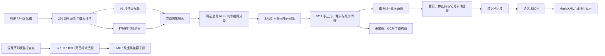

# STAFF 方法文档：实现对齐版 V2.1

> 文档修订：2026-07-13-r1  
> 对齐对象：当前工作区代码、命令行接口、运行日志与已生成实验产物  
> 文档定位：替代旧 `v18` 传统规则方法说明，作为当前 STAFF 实现的技术基线；旧文档保留用于追溯演化过程  
> 证据原则：仅将已经存在代码、模型、运行日志或输出产物的内容写为“已实现”；训练完成但尚未接入主流水线的模块单独标记；未来设计不计入当前方法

## 1. 方法定位

STAFF 当前不是单一端到端网络，而是由两条相互独立的技术路径组成：

1. **StaffOMR V2.1 模块化路径**：以谱表几何为坐标先验，将符号检测、SAM2 掩码细化、形状提取、关系图构建、事件组装和 MusicXML/线性化导出串成可检查的全流程。
2. **受控序列适配路径**：从公开的图像到序列模型权重出发，在固定目标域标注预算下进行微调，用于测量跨域迁移所需的数据量。

两条路径不交换预测结果。模块化路径回答“错误发生在哪个环节”，序列路径回答“跨域退化需要多少目标标注才能恢复”。因此，当前 STAFF 的主要贡献应表述为**可审计的跨域 OMR 实现与评测协议**，而不是“一个模型统一解决所有乐谱域”。

## 2. 总体流程



## 3. 输入、输出与符号表示

### 3.1 输入

主流水线接受 PNG 或 PDF。PDF 默认以 220 DPI 渲染。单次运行处理一张页面或一个数据集中已经定义好的系统图，不通过把测试页切成额外样本来扩大标注预算。

输入图像记为 $I\in\mathbb{R}^{H\times W\times C}$。第 $k$ 个谱表的五条谱线纵坐标记为

$$
\mathcal{L}_k=\{\ell_{k,1},\ldots,\ell_{k,5}\},
$$

相邻谱线间距的稳健估计记为 $s_k$。V2.1 中的距离、窗口和连接阈值尽量写成 $s_k$ 的倍数，而不是固定像素，以降低分辨率变化对几何规则的影响。

### 3.2 中间表示

流水线保留四级结构化表示：

| 层级 | 主要文件 | 内容 |
| --- | --- | --- |
| 符号层 | `symbols_v2.json` | 类别、框、置信度、来源、谱表归属和融合记录 |
| 形状与关系层 | `symbols_v2_1_shapes*.json` | 掩码、多边形、骨架、形状描述子、清理记录和显式关系边 |
| 事件层 | `notes_v2_1*.json` | 音符、休止符、记号、时值提示和来源符号引用 |
| 语义层 | `semantics_v2_1.json` | 分部、谱表、小节、事件以及导出限制 |

最终输出包括草稿 MusicXML、线性化文本、符号/关系 JSON、OCR 结果、检测与关系叠加图、重构图和每页运行日志。

## 4. StaffOMR V2.1 模块化路径

### 4.1 谱表几何与弱先验

流水线首先运行原有 V1 几何方法，估计二值化阈值、谱线、谱表组、谱间距和半间距音高网格。该阶段同时生成一组弱符号候选，包括符头、符杆、连梁、小节线、谱外加线、谱号、休止符、连音线/延音线和文本区域。

这些弱候选有三个用途：

1. 为每张输入建立分辨率归一化的几何坐标系；
2. 在检测器漏检时提供可配置的类别回退；
3. 生成可视化、裁剪图和可追踪的弱标签产物。

弱规则不是最终预测器。主线实验会显式记录最终采用 `detector` 还是 `rule` 作为融合优先级。

### 4.2 检测数据与类别体系

当前 `expanded_clean` 检测数据由 DeepScores 风格标注转换为 COCO 格式：

| 划分 | 图像数 | 实例数 | 类别数 |
| --- | ---: | ---: | ---: |
| Train | 1,362 | 872,416 | 58 |
| Validation | 352 | 239,796 | 58 |

58 类覆盖符头、符杆、连梁、谱外加线、附点、旗、四类谱号、升降还原号、五类休止符、连音线/延音线、数字与常用拍号、力度记号、渐强/渐弱发夹、奏法、延长记号、三/六连音、指法、踏板、装饰音、琶音线和大括号。类别 ID 在检测数据中使用从零开始的映射。

### 4.3 检测器后端

`run_v2_full_pipeline.py` 当前正式接入三种后端：

| 后端 | 当前状态 | 作用 |
| --- | --- | --- |
| DEIM-D-FINE | 已接入，当前主实验后端 | 输出 58 类符号框和置信度 |
| YOLO | 已接入，可选 | 使用相同类别映射进行替代检测 |
| Weak | 已接入，回退/消融 | 只使用 V1 弱规则候选 |
| RT-DETRv2 | 已训练，尚未接入主运行器 | 新检测器检查点与训练日志已生成，尚未完成 V2.1 全链路评测 |

主线 DEIM 推理的常用设置为：置信度阈值 0.05、类别内 NMS IoU 0.5、每页最多 1,000 个检测；自动推理模式可在整页与 1,280 像素滑窗之间选择，滑窗重叠率为 0.25，网络输入尺寸为 640。

DEIM 与 D-FINE 分别对应 BibTeX 键 `huang2025deim` 和 `peng2025dfine`。RT-DETRv2 对应 `lv2024rtdetrv2`。这些模块属于借用的检测架构，STAFF 的实现工作在于乐谱类别体系、数据转换、推理适配、弱先验融合及后续结构化解码。

#### RT-DETRv2 新增状态

当前工作区已完成一次 58 类 RT-DETRv2 训练并生成：

- `outputs/rtdetr_runs/rtdetrv2_symbol_expanded_clean/best_stg1.pth`
- `outputs/rtdetr_runs/rtdetrv2_symbol_expanded_clean/last.pth`
- `outputs/rtdetr_runs/rtdetrv2_symbol_expanded_clean/log.txt`

日志覆盖 epoch 0--147，模型参数量为 20,156,216。最后一个 epoch 的 COCO bbox 指标首三项为 AP 0.2846、AP50 0.3559、AP75 0.3282。该结果只说明训练流程和检测评测已经完成；由于主运行器的 `--detector` 选项尚不包含 `rtdetr`，本版本不把 RT-DETRv2 写成已完成的端到端方法或主结果。

### 4.4 检测与规则融合

对神经检测集合 $D$ 和弱规则集合 $R$，系统按类别执行重叠过滤与优先级选择，得到融合集合 $S$：

$$
S=\operatorname{Fuse}(D,R;\tau_{\mathrm{iou}},\pi,\mathcal{C}_r),
$$

其中 $\tau_{\mathrm{iou}}$ 默认为 0.5，$\pi\in\{\text{detector},\text{rule},\text{auto}\}$ 表示融合优先级，$\mathcal{C}_r$ 是允许由规则保留的类别集合。底层符号融合器支持 `auto`，当前总运行器对外暴露 `detector` 和 `rule` 两种选择。系统会将请求优先级、实际优先级、自动切换原因、保留类别和冲突删除记录到 `stack` 字段。

休止符与符头、符杆或连梁发生明显重叠时，默认启用冲突过滤，降低把音符局部误识别成休止符造成的插入错误。

### 4.5 谱号 ROI 与受限符号裁剪分类

检测后可加载两个局部分类阶段：

1. **谱号 ROI 补充器**在固定、连通域或自动 ROI 模式下补充低召回谱号；常用阈值为 0.4，最小类别间隔为 0.03。
2. **符号裁剪分类器**只允许在兼容符号族内重标注。融合必须同时满足族内条件概率阈值和目标族概率质量阈值，常用值分别为 0.55 和 0.5。

该约束防止局部分类器把谱号改成符头、把休止符改成升降号等跨族错误。分类器输出会记录候选数、接受数、族概率拒绝数和类别变化明细。

### 4.6 SAM2 掩码细化

每个融合框作为 SAM2.1 Hiera-Tiny 的提示。SAM2 对应 BibTeX 键 `ravi2025sam2`。当前实现支持三种提示策略：

| 策略 | 提示组成 | 用途 |
| --- | --- | --- |
| `box_only` | 仅检测框 | 原始基线与 GrandStaff 主线配置 |
| `box_positive` | 检测框 + 正点 | OLiMPiC 与部分全数据集运行 |
| `box_pos_neg_staff` | 检测框 + 正点 + 谱线负点 | 抑制谱线泄漏的消融策略 |

SAM2 在本系统中只负责边界提议，不直接决定音高、时值、声部或小节结构。掩码元数据按 `symbol_id` 写入 JSON，并可选择保存每个符号的二值掩码。

三种提示策略已经在 GrandStaff 200 页、OLiMPiC 200 页和 Polish 24 页上完成全量运行。Polish 的代理指标变化很小，因此当前证据不支持把更复杂提示描述为稳定的语义增益。

### 4.7 V2.1 形状提取与几何清理

SAM2 后，系统根据符号类型构造不同形状表示：

- 面状符号保存简化多边形、面积、长宽比和掩码统计；
- 符杆、连梁、谱外加线、小节线和连音线/延音线保存剪枝骨架、端点与方向；
- 所有距离和连接阈值优先使用谱间距归一化；
- 形状阶段执行重复符头、谱中伪谱号、无邻近符头连梁、休止符--符头冲突以及谱线状伪连音线清理；
- 当检测框包含明确的符头--纵向结构但缺少符杆时，允许生成带来源标记的合成符杆。

该阶段同时输出 `pass/warn` 几何检查、删除原因、合成符号数和叠加图。合成符号始终保留 `synthetic_*` 标识，避免与神经检测混淆。

### 4.8 谱表归一化关系图

形状节点构成图 $G=(V,E)$。当前主流水线实际写出的显式边类型为：

1. `notehead_stem_attachment`：符头--符杆连接；
2. `beam_stem_group`：连梁--符杆分组；
3. `ledger_line_notehead_attachment`：谱外加线--符头连接；
4. `slur_tie_notehead_endpoints`：连音线/延音线--端点符头连接。

候选边特征包括以谱间距归一化的横纵偏移、中心距离、宽高、重叠率、间隔、是否同谱表、两端置信度和关系类型。主流水线仍使用几何启发式构图，并为每条边保存分数与几何证据。

仓库中已经训练了四类关系的辅助评分器，并产生 `.joblib` 模型与独立验证指标；但这些评分器尚未替代主流水线中的 `geometry_heuristic_relation_graph_v2_1`。因此，新版方法将其列为**已完成的辅助原型**，不列为当前主方法组成。

### 4.9 音符、休止符与记号组装

事件组装以符头为锚点，连接可选符杆、连梁、谱外加线、升降号和连音线/延音线引用，形成音符对象。每个对象保存：

- `staff`、中心坐标和来源符号 ID；
- `pitch_step`：相对谱表半间距索引；
- `duration_hint`：由符头类别、符杆和连梁数推断的启发式时值；
- 连接到的符杆、连梁、谱外加线、升降号和连音线/延音线；
- 汇总置信度及其来源。

休止符和力度、发夹、踏板等记号作为独立事件保留。相邻基础记号可以组成复合记号，但当前语义导出仍以音符和休止符为主。

`duration_hint` 不是最终节拍保证；`pitch_step` 也不是绝对音名。绝对音高需要结合检测谱号，时值需要在小节和声部约束下进一步平衡。

### 4.10 过识别剪枝

当前语义误差以插入错误为主，因此 V2.1 在事件组装后、语义导出前增加可审计剪枝。可用预设包括 `recall`、`light`、`balanced`、`aggressive` 和 `visual_strict`。

GrandStaff 主线使用的 `balanced` 参数为：

| 参数 | 数值 |
| --- | ---: |
| 同谱表近似 x 列最大音符数 | 3 |
| 列聚合 x 容差 | 14 |
| 无符杆符头最小置信度 | 0.70 |
| 无符杆空心符头最小置信度 | 0.34 |
| 孤立未知符头最小置信度 | 0.60 |
| 邻域 x 容差 | 14 |

剪枝会单独输出前后音符数、按原因删除数量、按类别删除数量以及剪枝后的符号和关系集合。它不是不可见的测试时修补；任何数据集特定阈值必须与对应输出目录和评测报告一起记录。

### 4.11 语义导出、OCR 与重构

语义导出把事件按谱表、横向位置和小节线组织成草稿乐谱结构，默认 `divisions=16`，并生成：

- `semantics_v2_1.json`；
- `score_v2_1.musicxml`；
- `score_v2_1_linearized.txt`。

官方风格钢琴导出器提供可配置的 x 聚类容差、最低音符置信度、固定或声部和回退策略、固定小节单位、调号/拍号开关、方向记号开关和同音延音线推断开关。不同数据集的校准配置必须分别记录，不能把一种设置默认为所有域的统一最优参数。

文本区域通过独立 OCR 阶段处理。重构模块使用最终符号和 OCR 结果生成谱面重构图与输入对照图，用于发现漏检、重复检测和结构错连。

## 5. 受控序列适配路径

序列路径从公开的图像编码器--自回归 Transformer 解码器检查点开始。Transformer 对应 BibTeX 键 `vaswani2017attention`。给定源域 $\mathcal{D}_s$ 和目标域 $\mathcal{D}_t$，目标序列概率写为

$$
p(y\mid x)=\prod_{t=1}^{T}p(y_t\mid y_{<t},f_\theta(x)).
$$

目标域适配预算为 $B\in\{0,100,1000\}$，若数据集规模不足则使用全部可用训练页并明确报告真实数量。协议要求：

1. $B=0$ 时直接评测公开源域检查点，不更新参数；
2. $B>0$ 时只使用声明的目标训练页更新模型；
3. 目标测试划分在所有预算下保持不变；
4. 保留公开词表，除非实验明确标记为扩词表版本；
5. 失败或空预测计入错误，不从结果中删除；
6. 公开原始检查点、我们的适配运行和从头训练必须分别命名。

OLiMPiC 到 GrandStaff-LMX 的主适配设置为 batch size 8、4 个数据加载线程、学习率 $10^{-4}$、20 个固定 epoch，并对部分检查点执行低学习率续训；优化器为 AdamW（`loshchilov2019decoupled`）。该路径不接收 V2.1 的框、掩码或关系图，当前也没有把序列输出回灌给模块化路径。

## 6. 当前数据集配置

| 数据集/运行 | 检测与融合 | SAM2 | 分类与剪枝 | 输出与评测 |
| --- | --- | --- | --- | --- |
| 本地 18 个 MusicXML 示例 | DEIM `best_stg1`；`expanded_clean`；规则优先 | `box_positive` | 该历史产物未启用 DINOv2；未执行后续新增剪枝 | 草稿 MusicXML + 严格本地 MusicXML 评测 |
| GrandStaff-LMX test200 模块化主线 | DEIM `checkpoint0399`；检测器优先 | `box_only` | 谱号 ROI、受限裁剪分类、`balanced` 剪枝 | 官方风格钢琴 MusicXML -> LMX SER |
| OLiMPiC 模块化运行 | 固定 DEIM 预测 | 原生配置通常为 `box_positive` | 数据集校准剪枝/导出参数 | 官方 LMX SER；可选 TEDn |
| Polish 24 页 | 固定 DEIM 预测 | 三种提示均完成 | `balanced` 剪枝 | eKern 兼容代理 SER/CER/LER，不与 LMX 数值混排 |
| FP-GrandStaff | 模块化零样本运行 | 按运行目录记录 | 可选裁剪融合 | eKern 兼容代理指标 |

该表描述实际存在的运行配置，不表示各数据集参数已经统一，也不表示所有配置具有相同评测口径。

## 7. 消融与诊断设计

当前实现包含三类主要消融：

### 7.1 A/B/C/D 模块消融

四个二值开关定义为：

- A：规则与谱表先验；
- B：DEIM 检测；
- C：SAM2；
- D：关系图。

系统运行全部 $2^4=16$ 种组合。GrandStaff 与 OLiMPiC 均已完成 200 页、3,200 个“页面--变体”组合；Polish 已完成 24 页。该实验用于确认模块依赖和失败传播，不应把空预测变体解释为有效识别方法。

### 7.2 SAM2 提示消融

固定 DEIM 预测，仅切换 `box_only`、`box_positive` 和 `box_pos_neg_staff`，以隔离提示设计影响。当前 Polish 结果差异很小，说明语义瓶颈不主要来自提示掩码边界。

### 7.3 关系图参数消融

使用单因素变化检查符头--符杆距离、横向容差、每符杆最大符头数、连梁端点、谱外加线距离和连音线端点阈值。参数扫描与主结果分开保存，避免在测试集上反复选择规则后再把最优值当作固定方法。

## 8. 评测协议

### 8.1 检测与几何层

- 检测器使用 COCO bbox 指标；
- 形状层报告几何检查通过率和细长符号骨架覆盖率；
- 每个关系边保留分数和证据，便于定位错连。

这些指标只验证局部几何，不等价于完整 OMR 正确率。

### 8.2 符号与结构层

序列误差率定义为

$$
\mathrm{SER}=\frac{S+D+I}{N},
$$

其中 $S$、$D$、$I$ 分别为替换、删除和插入数，$N$ 为参考符号数。错误率可以超过 100%，因为插入数没有被 $N$ 上界约束。

LMX 实验使用对应数据集的正式或兼容实现。Polish 与 FP-GrandStaff 当前使用 eKern 兼容代理 SER/CER/LER，必须与官方 LMX 指标分表报告。OLiMPiC 评测器支持官方 LMX SER 和可选 TEDn；无法线性化的预测默认按空预测计错，而不是跳过。

### 8.3 失败分类

最终错误按四类记录：

1. **Pitch**：谱号、升降号、八度和谱表相对位置错误；
2. **Duration**：符头类型、旗/连梁、附点和连音节奏错误；
3. **Voice**：和弦分组、谱表归属、backup 和阅读顺序错误；
4. **Structure**：小节缺失、非法 MusicXML、重复/调拍号和词表不一致。

## 9. 已实现边界

### 9.1 已接入主流水线

- PDF/PNG 输入、220 DPI 渲染与谱表几何；
- V1 弱标签与符号裁剪；
- DEIM-D-FINE、YOLO、Weak 三种检测后端；
- 规则/检测器融合与休止符冲突过滤；
- 可选谱号 ROI 补充和受限符号裁剪分类；
- SAM2 三种提示策略；
- 多边形、骨架、几何清理和合成符杆；
- 四类显式关系图；
- 音符、休止符、记号与启发式时值组装；
- 多预设过识别剪枝；
- 草稿与官方风格 MusicXML、线性化文本、OCR 和可视化；
- LMX、MusicXML 和代理 eKern 评测脚本。

### 9.2 已完成但未接入主方法

- 58 类 RT-DETRv2 训练和检测评测；
- 四类关系的学习式辅助评分器；
- DINOv2 裁剪嵌入阶段。DINOv2 对应 `oquab2023dinov2`，但当前主结果运行通常显式 `--skip-dinov2`，因此不应写成主结果必需模块。

### 9.3 尚未完成

- RT-DETRv2 到 V2.1 全链路的接入与同协议比较；
- 学习式关系评分器对几何图的正式替换或融合；
- 受约束序列解码与模块化图信息融合；
- 稳定的声部、跨谱表连梁、连音、重复、调号和拍号恢复；
- 所有数据集统一到同一种官方语义表示和指标；
- 双向完整的 0/100/1000 页适配矩阵。

## 10. 当前限制

1. **绝对音高仍是近似值。** 当前由 `pitch_step` 和检测谱号转换为近似自然音高，升降号作用域和调号尚不完整。
2. **节奏未做严格小节平衡。** `duration_hint` 由局部符号组合推断，不能保证每个声部或小节时值合法。
3. **全局结构是主要瓶颈。** 声部、阅读顺序、backup、跨谱表关系和重复结构仍可能错误。
4. **规则融合具有数据集依赖。** 本地 18 样例曾使用规则优先，而 GrandStaff 主线使用检测器优先；两者不能被描述为一个未经说明的统一设置。
5. **SAM2 不是语义解码器。** 更好的掩码边界并不会自动解决音高、时值和声部错误。
6. **裁剪分类只解决局部混淆。** 它不能修复漏谱表、错阅读顺序或缺失小节。
7. **代理指标不可跨协议比较。** Polish/FP-GrandStaff 的 eKern 代理结果不能与 LMX SER 直接排名。
8. **RT-DETRv2 尚无端到端结论。** 当前只有训练和检测层证据。

## 11. 复现入口

### 11.1 单页 V2.1 主流水线

```powershell
python tools/run_v2_full_pipeline.py `
  --input <page.png> `
  --out-root <output-dir> `
  --detector deim `
  --deim-dataset-root outputs/v2_deim_ds_all_expanded_clean `
  --deim-config .local-tools/DEIM-main/configs/deim_dfine/deim_symbol_v2_expanded_clean_5070ti.yml `
  --deim-checkpoint outputs/v2_deim_runs/v2_symbol_all_expanded_clean_5070ti/checkpoint0399.pth `
  --skip-deim-dataset-prepare --skip-deim-config --skip-deim-train `
  --deim-taxonomy expanded_clean `
  --fusion-preference detector `
  --sam2-prompt-strategy box_only `
  --v2-1-prune-preset balanced
```

### 11.2 全数据集 MusicXML 示例

```powershell
python tools/run_musicxml_full_dataset_v2_1.py `
  --detector deim `
  --use-sam2 `
  --sam2-prompt-strategy box_positive `
  --deim-taxonomy expanded_clean `
  --v2-1-prune-preset balanced
```

### 11.3 SAM2 提示全量消融

```powershell
python tools/run_sam2_prompt_ablation.py --dataset grandstaff
python tools/run_sam2_prompt_ablation.py --dataset olimpic
python tools/run_sam2_prompt_ablation.py --dataset polish
```

## 12. 关键实现与证据索引

| 内容 | 路径 |
| --- | --- |
| 当前总运行入口 | `tools/run_v2_full_pipeline.py` |
| 全数据集入口 | `tools/run_musicxml_full_dataset_v2_1.py` |
| SAM2 提示消融 | `tools/run_sam2_prompt_ablation.py` |
| 检测器训练完成标记工具 | `tools/write_detector_training_marker.py` |
| 58 类检测数据摘要 | `outputs/v2_deim_ds_all_expanded_clean/summary.json` |
| GrandStaff test200 单页完整命令日志示例 | `outputs/ijcv_repro/ours_grandstaff_lmx_test200_zero_v2_1_sam2_cropfusion/grandstaff_lmx_test_00000/logs/pipeline.log` |
| 本地 18 样例完成摘要 | `outputs/musicxml_full_dataset_v2_1_sam2_box_positive/full_dataset_summary.json` |
| A/B/C/D 消融 | `outputs/abcd_ablation/` |
| 关系参数消融 | `outputs/graph_parameter_ablation/` |
| SAM2 提示全量消融 | `outputs/sam2_prompt_full_ablation/` |
| 学习式关系评分器 | `outputs/v2_1_relation_scorer/` |
| RT-DETRv2 训练产物 | `outputs/rtdetr_runs/rtdetrv2_symbol_expanded_clean/` |
| 论文引用库 | `paper/aaai27/staff_refs.bib` |

## 13. 与旧方法文档的核心差异

旧 `traditional_omr_research_proposal.md` 以 `v18` 传统图像处理 demo 为中心，并把神经检测、分割、关系图和 MusicXML 解码写成后续计划。当前实现已经发生以下实质变化：

1. 神经检测已成为可运行主干，而不是未来任务；
2. 类别体系从少量几何对象扩展为 58 类符号检测；
3. SAM2 掩码、多边形、骨架和关系图已经落地；
4. 音符/休止符/记号事件和草稿 MusicXML 已经可以批量生成；
5. 增加了谱号 ROI、受限裁剪分类和过识别剪枝；
6. 已具备公开数据集、全量消融和多协议评测产物；
7. 研究重点从“传统规则能做到哪里”转为“局部几何与全局语义之间的瓶颈，以及跨域适配的数据效率”。

因此，后续论文或汇报中的“方法”应以本文件为实现基线；旧 proposal 仅用于说明项目早期动机和 v18 演化历史。
