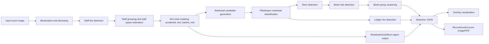

# Research Proposal: Interpretable Traditional OMR Pipeline for Dense Piano Scores

## 1. Title

**面向复杂钢琴五线谱图像的可解释传统 OMR 识别方法研究**

英文题目：**An Interpretable Rule-Based Optical Music Recognition Pipeline for Dense Piano Score Images**

## 2. Abstract

本研究拟围绕复杂钢琴五线谱位图的 Optical Music Recognition (OMR) 任务，构建一套以传统图像处理和几何规则为核心的可解释识别流程。当前工作已经完成一个 demo：从二值化谱面出发，定位五线谱线与 staff space，进一步识别符头、符杆、小节线、连梁、休止符、升降号、文字区域、谱外加线，并输出 JSON、叠加可视化图、权重图、重构图和 PDF。

本 proposal 的核心目标不是直接训练端到端神经网络，而是先证明：在高质量二值谱面上，传统几何规则可以形成一条可调试、可解释、可逐步扩展的 OMR pipeline。研究将使用现有本地数据集、DeepScores 风格密集图片数据、Hugging Face `PRAIG/polish-scores` 作为候选扩展数据，并以当前 `v18` demo 为 baseline，系统评估规则模块在不同符号类型上的效果与失败模式。

### 2.1 Updated Research Goal

本项目的最终目标需要明确调整为：**构建一个以神经网络为核心的 OMR 系统，并结合 LLM 做音乐教育场景下的解释、纠错和练习反馈**。当前传统图像处理 pipeline 不是最终方案，而是第一阶段的可解释 baseline。

这一阶段的作用是：

1. 先用传统图像处理验证五线谱识别中哪些部分可以被稳定规则化，例如 staff line、staff space、小节线、符杆、部分符头、谱外加线。
2. 系统暴露传统方法的不足，例如密集和弦、符号重叠、跨谱表关系、复杂休止符、谱号/文字识别、真实扫描噪声和跨字体泛化。
3. 把失败案例转化成神经网络训练任务，例如 notehead detector、symbol classifier、beam/rest/accidental detector、semantic segmentation 或 graph relation prediction。
4. 为后续神经网络提供可解释的中间标注和调试视图，使模型训练不是黑盒试错，而是围绕明确的错误类型逐步推进。
5. 最终将 OMR 结构化输出交给 LLM，用于音乐教育中的自然语言讲解、错音定位、节奏纠错、练习生成和交互式答疑。

因此，本 proposal 的研究路线不是“传统方法替代神经网络”，而是：

```text
traditional image processing baseline
-> failure mode analysis
-> neural detector / segmentation / relation model
-> structured score output
-> LLM-assisted music education feedback
```

## 3. Current Resources and File Inventory

### 3.0 GitHub Repository Layout

GitHub 仓库只保留当前 demo 必需内容和文档，不上传大体量数据集。推荐仓库路径如下：

```text
README.md
requirements.txt
tools/traditional_omr_demo.py
docs/traditional_omr_research_proposal.md
docs/traditional-omr-process-walkthrough.pptx
docs/contact-sheet.png
examples/lg2267728_v18/input/lg-2267728-aug-beethoven--page-2.png
examples/lg2267728_v18/results/binary_cleaned_input.png
examples/lg2267728_v18/results/detection_result.json
examples/lg2267728_v18/results/overlay_detected_staff_notes.png
examples/lg2267728_v18/results/notehead_weight_regions.png
examples/lg2267728_v18/results/reconstructed_from_detection.png
examples/lg2267728_v18/results/demo_visual_result.pdf
```

大文件数据集不进入 GitHub：

```text
dataset/
ds2_dense/
data/
.venv/
outputs/
```

如需复现实验，可使用 GitHub 中的单张 demo 输入图；如需大规模评测，再按第 15 节链接下载公开数据集。

### 3.1 Local Score Dataset

本地目录：`D:\PyCharmPojects\Staff\dataset`

GitHub 状态：不上传该目录，仅在 proposal 中记录为本地实验资源。

该目录包含少量人工可检查的乐谱文件，适合做小规模验证、对照和人工审阅：

| 类型 | 数量 | 用途 |
|---|---:|---|
| `.pdf` | 6 | 原始谱面或打印谱面输入，可渲染成图片用于 OMR |
| `.mxl` | 4 | 可编辑乐谱目标格式，可作为弱 ground truth 或结构对照 |
| `.omr` | 4 | MuseScore/乐谱工程文件，可辅助导出、校对或重新渲染 |

主要文件包括：

- `call of silence.pdf/.mxl/.omr`
- `My Dearest - Guilty Crown - Opening Theme.pdf/.mxl/.omr`
- `unravel (final).pdf/.mxl/.omr`
- `【Animenz】unlasting - Sword Art Online Alicization War of Underworld - Ending Theme.pdf/.mxl/.omr`
- `【Animenz】unlasting ... -print.pdf`

### 3.2 Dense Score Image Dataset

本地目录：`D:\PyCharmPojects\Staff\ds2_dense\ds2_dense`

GitHub 状态：不上传完整 `ds2_dense`；仅复制当前 demo 使用的单张输入图到：

```text
examples/lg2267728_v18/input/lg-2267728-aug-beethoven--page-2.png
```

该目录是当前 demo 的主要图像来源，包含：

| 内容 | 数量/说明 |
|---|---|
| `images/*.png` | 5142 张谱面图片 |
| `deepscores_train.json` | 训练标注 JSON，约 226 MB |
| `deepscores_test.json` | 测试标注 JSON，约 62 MB |
| `instance/` | instance annotation 相关文件 |
| `segmentation/` | segmentation annotation 相关文件 |

当前 v18 demo 使用的样例图片：

```text
examples/lg2267728_v18/input/lg-2267728-aug-beethoven--page-2.png
```

### 3.3 Usable Public Datasets

除了本地已经下载的数据，本研究还可以使用以下公开 OMR 数据集。选择原则是：先用和当前任务最接近的 printed / piano / full-page 数据做主评测，再用 handwritten、monophonic、symbol-level 数据做模块补强。

| 数据集 | 类型 | 适合本研究的用途 | 注意事项 |
|---|---|---|---|
| **DeepScoresV2 / DeepScoresV2-dense** | 大规模合成 printed score object detection 数据 | 当前 `ds2_dense` 已在本地；适合训练/验证符号检测、小节线、符杆、连梁、谱线定位 | 更偏符号检测，不直接等价于完整 MusicXML 重建 |
| **PRAIG / polish-scores 或 Hugging Face polish-scores** | 真实谱面/扫描谱面候选数据 | 适合测试真实扫描噪声、排版差异和 full-page 泛化 | 下载时需要确认具体 split、label 格式和 license |
| **OpenScore / OpenScore-Lieder / OpenScore-StringQuartets** | 从 MusicXML 渲染的页面图像，带 per-page MusicXML | 适合把 OMR 输出和 MusicXML ground truth 对比，也适合后续 LLM/VLM SFT | quartet 子集需要检查 label 完整性；Lieder 更适合钢琴伴奏场景 |
| **OpenScore-Lieder piano-only evaluation subset** | piano-only full-page OMR evaluation | 和钢琴大谱表任务非常接近，可用于 page-level 评测 | 数据量较小，但 ground truth 质量高 |
| **OLiMPiC** | OpenScore Lieder Linearized MusicXML Piano Corpus | 适合研究 pianoform OMR、Linearized MusicXML、TEDn 等结构指标 | 更偏 end-to-end 序列任务，可作为结构评估参照 |
| **GrandStaff / FP-GrandStaff** | synthetic pianoform score images with symbolic encoding | 适合钢琴双 staff、beam、voice、measure 结构实验 | 多为合成或渲染数据，真实扫描泛化需另测 |
| **SMB / Sheet Music Benchmark** | monophony、pianoform、quartet 等多类型 OMR benchmark | 适合做跨纹理、跨任务的统一对比，也适合引入 MusicDiff / OMR-NED 类指标 | 需要把其 Humdrum `**kern` 表示和本项目 JSON/MusicXML 对齐 |
| **PrIMuS / Camera-PrIMuS** | monophonic single-staff incipits，含 PNG、MIDI、MEI、semantic/agnostic encoding | 适合测试单 staff 的 pitch/duration 基础识别和相机畸变鲁棒性 | 单声部、单 staff，和复杂钢琴 full-page 有差距 |
| **CVC-MUSCIMA** | handwritten staff removal / handwritten score images | 适合测试谱线去除、手写鲁棒性 | 主要用于 handwritten / staff removal，不是当前 printed piano 主目标 |
| **MUSCIMA++** | handwritten notation with symbol annotations and symbol relationships | 适合研究符号关系图、notehead-stem-beam 连接关系 | 手写域和 printed 域差异大，但关系标注很有价值 |
| **HOMUS / Universal Music Symbol Collection** | handwritten isolated music symbols | 适合训练或测试单符号分类器，例如休止符、升降号、谱号 | isolated symbol，不含完整谱面上下文 |
| **JAZZMUS** | handwritten jazz lead sheets | 适合后续扩展 chord symbol、lead sheet、手写旋律识别 | 与钢琴双 staff 目标不同，可作为拓展方向 |
| **Debussy OMR datasets** | historical handwritten / system-level / full-page OMR 数据 | 适合测试历史手写谱泛化能力 | 不作为当前第一阶段主数据 |
| **MusiCorpus** | historical / handwritten Western notation with MusicXML and symbol annotations | 适合未来评估真实馆藏、历史手稿和端到端/检测式 OMR | 新近数据集，正式使用前需核验下载、license 和标注格式 |

数据使用优先级建议：

1. **主线评测**：本地 `ds2_dense` + OpenScore-Lieder / OLiMPiC / GrandStaff。
2. **真实扫描泛化**：polish-scores、OpenScore-Lieder camera/rendered pair。
3. **模块补强**：MUSCIMA++ 用于符号关系，PrIMuS 用于单 staff 序列，HOMUS 用于单符号分类。
4. **教育场景拓展**：OpenScore-Lieder、GrandStaff 和本地 `.mxl` 文件可生成标准答案，适合给 LLM 做讲解、纠错和练习题生成。

补充说明：`apacha/OMR-Datasets` 是一个 OMR 数据集索引仓库，覆盖 staff detection/removal、CNN 训练、符号分类、对象检测、语义分割、端到端识别、基准比较等任务。它适合作为本研究的数据入口清单，而不是单一数据集。截图中提到的关键数据集可以按任务拆解如下：

| 数据集 | 截图中关键信息 | 对本研究的价值 |
|---|---|---|
| HOMUS | 约 15,200 个手写音乐符号 | 可用于 isolated symbol 分类，例如休止符、谱号、升降号的模板或小模型补强 |
| Universal Music Symbol Collection | 约 90,000 个 printed + handwritten 音乐符号 | 可用于离线符号分类和跨字体符号鲁棒性测试 |
| CVC-MUSCIMA | 约 1,000 张手写乐谱图像 | 适合 staff removal、手写谱鲁棒性和 writer identification 相关实验 |
| DeepScores V1 / V2 | 大规模 printed score image 数据 | 适合符号分类、对象检测和语义分割；当前本地 `ds2_dense` 可视作这一方向的主要实验数据 |
| PrIMuS | 约 87,678 个 incipits | 适合端到端识别、semantic / agnostic encoding、单 staff pitch-duration 基础实验 |

其中 `mymusic5.com` 更偏实际乐谱资源入口，可作为人工挑选测试谱面的补充来源；正式写入研究数据集时，需要先确认版权、下载许可和是否有可用 ground truth。

### 3.4 Existing Code

主脚本：

```text
tools/traditional_omr_demo.py
```

该脚本是当前传统 OMR demo 的核心实现，已经包含二值化、谱线定位、符头候选、符杆、连梁、小节线、休止符、临时记号、文字区域、谱外加线、JSON 输出和可视化重构等模块。

### 3.5 Existing Demo Outputs

当前最终示例目录：

```text
examples/lg2267728_v18/results
```

关键输出文件：

| 文件 | 作用 |
|---|---|
| `binary_cleaned_input.png` | 二值化/清理后的输入图 |
| `detection_result.json` | 结构化识别结果 |
| `overlay_detected_staff_notes.png` | 检测结果叠加图 |
| `notehead_weight_regions.png` | 符头中心、候选区域、权重图可视化 |
| `reconstructed_from_detection.png` | 根据 JSON 重构出的谱面示意图 |
| `demo_visual_result.pdf` | 可展示的 PDF 结果 |

v18 当前统计结果：

| 类别 | 数量 |
|---|---:|
| staff lines | 50 |
| staves | 10 |
| noteheads | 457 |
| filled noteheads | 415 |
| open noteheads | 42 |
| stems | 357 |
| ledger lines | 288 |
| barlines | 46 |
| rests | 9 |
| accidentals | 21 |
| text regions | 5 |
| beams | 9 |
| beam links | 141 |
| beam groups | 68 |
| slurs or ties | 3 |

### 3.6 Existing Presentation

PPT 文件：

```text
docs/traditional-omr-process-walkthrough.pptx
```

PPT 共 14 页，内容包括：

1. 项目目标与 v18 当前识别统计。
2. 最初的处理思路：先定位谱线和 staff space，再扫描符号。
3. 传统 OMR pipeline 总览：二值化、谱线定位、干扰屏蔽、符头候选、结构识别、JSON 重构。
4. 谱线定位方法和必要参数。
5. 符头权重图方法和 filled/open 判断。
6. 第一轮问题：连梁、休止符、小节线、谱号、文字、升号、谱外音、实心空心混淆。
7. v1 到 v18 的迭代时间线。
8. 连梁识别：基于符杆终端、斜率 corridor 和 beam group。
9. 非音符符号过滤：升号、文字、休止符、小节线。
10. 谱外加线识别：根据符头位置向 staff 外扩展检测短横线。
11. 漏检符头修复：固定 x 网格与音高带投影结合。
12. 实心符头误判为空心的修复：同时使用 cleaned mask 和 raw binary mask。
13. 当前 v18 最终示例：overlay、权重图、重构图和统计结果。
14. 当前结论、限制和后续方向。

## 4. Research Problem

复杂钢琴五线谱具有以下特点：

- 符号密度高，局部区域内可能同时存在谱线、符头、符杆、连梁、升降号、文字、休止符和小节线。
- 音高高度依赖几何位置，半个 staff space 的误差就可能导致音高错误。
- 八分音符、十六分音符等需要同时识别符头、符杆和连梁结构。
- 谱外音需要通过 ledger line 推断，不能只依赖五线谱内部 5 条线。
- 文字、升号、休止符等非符头符号容易污染局部黑色分布，导致误检。
- 单纯依赖神经网络或 LLM 难以解释错误来源，也不利于逐步修正规则。

因此，本研究关注的问题是：

> 能否在不先训练神经网络的前提下，用传统图像处理和可解释几何规则，构建一个可视化、可调试、可扩展的 OMR demo，并逐步逼近可用的结构化乐谱识别？

补充后的问题定义是：传统方法需要回答“规则方法能做到哪里、为什么失败、失败样本如何转化成监督信号”；神经网络阶段需要回答“哪些模块应由 detector、classifier、segmentation 或 relation model 接管”；LLM 阶段需要回答“如何把结构化乐谱结果转化成学生可理解的音乐教育反馈”。

## 5. Research Questions

1. **Staff 定位问题**  
   如何稳定地从二值化谱面中检测水平长直线，并估计 staff space？

2. **符头识别问题**  
   如何利用符头位于谱线或线间半格位置的几何约束，结合局部权重图，区分符头与其他黑色符号？

3. **filled/open 分类问题**  
   当去谱线操作破坏符头中心时，如何避免把实心符头误判为空心符头？

4. **连梁结构问题**  
   如何从符杆终端出发，根据斜率一致性和连续符杆关系，把 beam links 收敛为 beam groups？

5. **非音符符号过滤问题**  
   如何在符头检测前先屏蔽升号、文字、小节线、休止符等区域，降低误检？

6. **谱外音问题**  
   如何在符头超出 staff 范围时，通过 ledger line 数量推断其相对音高？

7. **可视化调试问题**  
   如何把每次错误转化成可观察的 overlay、权重图和 JSON 字段，从而形成可复现的迭代流程？

## 6. Proposed Method

本节方法描述的是**第一阶段传统图像处理 baseline**。它的目标不是成为最终系统，而是提供：

- 可运行的 demo。
- 可解释的中间结果。
- 可视化错误分析。
- 后续神经网络模块的训练目标和替换边界。

第二阶段会把传统方法中不稳定的模块逐步替换或增强为神经网络模块，例如符号检测、语义分割、符号分类、关系图预测和 MusicXML/linearized score decoding。

### 6.0 Plain-Language Explanation of the Method

这套方法可以用一个很通俗的比喻理解：**先给乐谱画坐标系，再在坐标系上找零件，最后把零件重新装回一张可解释的乐谱结构图。**

1. **先找五线谱的“尺子”**  
   五线谱最稳定的东西不是符头，而是五条等距横线。只要先找到这些长横线，就能知道这一页的 staff space，也就是后面所有判断的基本单位。符头大小、符杆长度、谱外加线距离、小节线高度，都可以按这个单位缩放。

2. **把谱面变成黑白图，减少噪声**  
   原图可能有灰度、压缩噪声和背景色。先二值化成黑白图，就像把乐谱复印成高对比度版本，后面只需要判断“这里有没有黑色像素”。

3. **先排除明显不是符头的东西**  
   升号、文字、小节线、休止符都可能是黑色，也可能刚好落在符头附近。如果不先排除它们，算法就容易把 `#`、`To Coda` 或休止符当成音符。所以当前思路是先标出这些“非音符区域”，再检测符头。

4. **符头检测像拿一个模板去对齐**  
   每个可能的音高位置都放一个椭圆形权重图：外圈看周围有没有干扰，本体看是不是像符头，中心看是实心还是空心。这样不是简单数黑色像素，而是看黑色是否出现在“符头应该出现的位置”。

5. **实心/空心不能只看去谱线后的图**  
   去掉五线谱线时，可能会把实心符头中间也擦掉，导致它看起来像空心。v18 的改法是同时看原始二值图和去谱线图：如果原图中心是黑的，但去谱线图中心没了，就认为这是去谱线造成的误伤，而不是空心符头。

6. **连梁不是凭感觉识别，而是从符杆终点连线**  
   对八分音符或十六分音符，先找到每个符头的竖直符杆，再找符杆末端之间有没有一条斜线或横线真实存在。如果存在，再根据斜率一致性和连续符杆把它们合并成 beam group。

7. **谱外音靠加线数量推断**  
   如果符头超出五线谱，就不能只看五条线。算法会继续向上或向下按 staff space 扫描短横线，数出 ledger lines 的数量，从而判断这个音到底在五线谱外第几格。

8. **每一步都必须能画出来**  
   这套方法最重要的不是一次识别全对，而是每个错误都能被看见：overlay 看检测框，weight map 看候选区域，JSON 看结构结果，reconstruction 看能否从结构还原乐谱。这样每次失败都能变成下一轮规则改进。

整体 pipeline 如下：



### 6.1 Preprocessing and Binarization

当前 demo 采用灰度图二值化，将谱面先转成黑白图，减少背景噪点和灰度差异。

关键参数：

```text
threshold = min(212, max(170, Otsu + 35))
v18 threshold = 174
```

后续计划：

- 对不同来源 PDF/PNG 统一渲染分辨率。
- 增加轻量去噪、形态学清理和倾斜校正。
- 记录每张图的 threshold、staff space、符号统计，形成可追踪实验日志。

### 6.2 Staff Line Detection

利用五线谱线水平、等距、成组出现的特点：

1. 对二值图做水平投影。
2. 找到足够长的水平黑色 run。
3. 统计相邻谱线 y 差，估计 staff space。
4. 将连续 5 条线聚合成一个 staff。
5. 对整页重复，得到所有 staff 系统。

关键参数：

```text
row_projection_threshold = max(width * 0.22, p99.5 * 0.62)
staff_group_tolerance = max(2.4, staff_space * 0.22)
v18 staff_space = 16.75 px
```

### 6.3 Notehead Candidate Detection

候选符头基于两个约束：

- y 坐标必须落在 staff line 或 line-space 的半格网格上。
- 局部区域应符合符头椭圆形黑色分布。

权重图采用三层椭圆：

```text
rx = max(5, round(staff_space * 0.78))
ry = max(4, round(staff_space * 0.50))
inner = rx * 0.50, ry * 0.48
core = rx * 0.34, ry * 0.30
```

候选扫描：

```text
pitch_step range = -10 ... 18
step_x = max(2, round(staff_space / 4))
projection_band = cy +/- 0.72 * staff_space
candidate_run_width = 0.26 * staff_space ... 3.2 * staff_space
```

### 6.4 Filled/Open Classification

早期版本容易把实心符头识别为空心符头。根因是去谱线图会把符头中心也擦掉，导致 cleaned mask 中心偏白。

v18 的修正方法是同时检查：

- `cleaned mask`：用于减少谱线干扰。
- `raw binary mask`：用于判断符头原始中心是否本来是黑色。

关键规则：

```text
raw_core >= 0.68
raw_inner >= 0.58
raw_outer >= 0.62
raw/cleaned core-inner difference >= 0.42 => likely staff-line removal damage
open_score = 0.72 * ring + 0.30 * hole_bonus - 0.22 * surround
```

### 6.5 Stem and Beam Group Detection

符杆检测：

- 从已识别符头出发，垂直扫描。
- 记录符杆位置、长度、方向和终端点。

连梁检测：

- 对符杆终端点两两建立斜线 corridor。
- 计算真实图像中该 corridor 的黑色命中率。
- 如果命中率和密度足够高，则形成 beam link。
- 再根据斜率一致性和连续符杆关系合并为 beam group。

关键参数：

```text
beam_hit_ratio >= 0.58
beam_density >= 0.16
slope_tolerance <= 0.22
```

### 6.6 Non-Note Symbol Filtering

为了避免把升号、文字、休止符误识别成符头，v18 引入符号屏蔽流程：

```text
note_mask = cleaned
            & ~long_run
            & ~accidental_mask
            & ~text_mask
```

处理对象包括：

- accidental：根据组件宽高、位置、staff space 归一化识别 sharp/natural 等。
- text region：按 baseline 聚类，先做轻量模板识别，如 `To Coda`、`8va`、`al Coda`。
- barline：在 staff y 范围内找垂直长 run。
- rest：排除 notehead-like、stem-near、beam-group-near、barline-near 组件后再判断。

关键参数：

```text
barline_min_len = 3.55 * staff_space
```

### 6.7 Ledger Line Detection

对于超出五线谱外的符头：

1. 判断符头是否高于 top staff line 或低于 bottom staff line。
2. 从最近 staff 边界开始，每隔一个 staff space 扫描短横线。
3. 检测短横线是否穿过符头附近。
4. 根据 ledger line 数量推断音高位置。

关键参数：

```text
outside_staff_boundary = +/- 0.45 * staff_space
ledger_run_length = 0.75 * staff_space ... 3.0 * staff_space
```

### 6.8 Transition to Neural Network Models

传统 pipeline 的输出将用于决定哪些模块最需要神经网络接管。初步分工如下：

| 模块 | 传统方法当前作用 | 后续神经网络方向 |
|---|---|---|
| Staff line / staff space | 提供几何坐标系，当前较稳定 | 保留传统方法，或用轻量 segmentation 增强倾斜/弯曲谱线 |
| Notehead detection | 当前依赖权重图和 pitch-band projection | 训练 notehead detector 或 segmentation model，降低漏检和误检 |
| Filled/open classification | 当前依赖 raw/cleaned mask 复核 | 训练局部符头分类器，输入符头 crop + staff context |
| Accidentals / rests / clefs | 当前规则容易受字体影响 | 训练 symbol detector/classifier |
| Beam / slur / tie | 当前依赖符杆终端和斜率 corridor | 训练细长目标检测或 relation model |
| Symbol relationships | 当前主要靠启发式规则 | 构建 notehead-stem-beam-accidental graph prediction |
| MusicXML decoding | 当前尚未完整实现 | 结合 graph decoder 或 sequence decoder 输出 MusicXML / Linearized MusicXML |

最终系统将采用混合路线：传统几何模块负责稳定坐标系和可视化调试，神经网络负责高变异符号检测和关系建模，LLM 负责教学解释和交互反馈。

## 7. Baseline Result

当前 baseline 是 `v18` demo。输入图像为：

```text
examples/lg2267728_v18/input/lg-2267728-aug-beethoven--page-2.png
```

输出目录：

```text
examples/lg2267728_v18/results
```

当前 demo 已经可以展示完整链路：

```text
image -> binary image -> detection_result.json -> overlay visualization -> reconstructed image/PDF
```

但它仍然是 demo 级别，尚未完成严格 precision/recall 评估，也没有稳定输出 MusicXML。

## 8. Evaluation Plan

### 8.1 Component-Level Metrics

对每类符号分别评估：

- Staff line recall / precision
- Notehead detection precision / recall / F1
- Filled/open classification accuracy
- Stem detection F1
- Barline detection F1
- Beam group detection F1
- Rest detection F1
- Accidental detection F1
- Ledger line detection F1

### 8.2 Structure-Level Metrics

如果存在 `.mxl` 或可导出的 MusicXML ground truth，则进一步评估：

- Pitch accuracy
- Duration accuracy
- Measure rhythm consistency
- Voice assignment consistency
- Beam grouping consistency
- Accidental scope consistency
- MusicXML diff / symbolic edit distance

### 8.3 Visualization-Based Debugging

每次实验必须保存：

- 原图或输入裁剪。
- 二值化图。
- overlay 检测图。
- notehead weight regions。
- reconstruction 图。
- `detection_result.json`。

这样可以把错误归因到具体模块，而不是只看最终重构是否“像”。

## 9. Experiment Plan

### 9.1 Experiment A: Staff Detection Robustness

数据：

- `ds2_dense` 中不同字体、不同 page 的 PNG。
- `dataset` 中 PDF 渲染出的谱面。

目标：

- 测试 staff space 估计是否稳定。
- 测试水平投影阈值是否需要按图像来源自适应。

### 9.2 Experiment B: Notehead Detection and Filled/Open Classification

对比版本：

- 仅 cleaned mask。
- cleaned mask + raw binary mask。
- 固定 x 网格。
- 固定 x 网格 + pitch-band projection。

目标：

- 减少实心符头被误判为空心符头。
- 减少升号、文字、休止符误入符头。
- 降低漏检率。

### 9.3 Experiment C: Stem and Beam Grouping

对比：

- 只识别 beam link。
- beam link + slope consistency。
- beam link + slope consistency + continuous stem grouping。

目标：

- 把两个或三个八分音符组成的连梁结构收敛成稳定 beam group。

### 9.4 Experiment D: Ledger Line and Outside-Staff Notes

目标：

- 对谱外高音/低音符头检测 ledger lines。
- 根据加线数量补充音高推断。

### 9.5 Experiment E: Symbol Masking Ablation

对比：

- 不屏蔽 accidental/text/rest/barline。
- 屏蔽 accidental。
- 屏蔽 accidental + text。
- 屏蔽 accidental + text + barline + rest。

目标：

- 量化“先定义非符头区域”对符头 precision 的提升。

## 10. Timeline

| 阶段 | 时间 | 任务 |
|---|---|---|
| Phase 1 | 第 1 周 | 整理数据集、统一输入格式、建立实验目录规范 |
| Phase 2 | 第 2 周 | 完善 staff detection 和二值化参数日志 |
| Phase 3 | 第 3-4 周 | 系统评估符头检测、filled/open 分类和误检屏蔽 |
| Phase 4 | 第 5 周 | 完善 stem、beam link、beam group 结构识别 |
| Phase 5 | 第 6 周 | 完善 ledger line、barline、rest、accidental、text region |
| Phase 6 | 第 7 周 | 建立小规模人工标注评测集，输出 component metrics |
| Phase 7 | 第 8 周 | 生成最终报告、PPT、demo PDF、JSON schema 和可复现实验脚本 |

## 11. Expected Contributions

1. **一条可解释的传统 OMR pipeline**  
   从输入图像到 JSON、overlay、weight map 和 reconstruction，每个阶段都有可视化输出。相比只给出最终 MusicXML，这种中间过程更适合教学、调试和人工校对。

2. **一个错误驱动的规则迭代框架**  
   每次误识别都被归因到候选生成、符号屏蔽、分类规则或结构分组。这样后续无论引入小模型、OCR 还是 LLM，都可以知道它们应该解决哪一类错误，而不是盲目替换整个系统。

3. **一套面向复杂钢琴谱的符号级解释视图**  
   包括 staff overlay、notehead weight regions、beam groups、ledger lines、barlines、rests、accidentals 和 text regions。这些视图不仅用于算法调试，也可以转化成学生能理解的“乐谱结构讲解图”。

4. **一个可复现的小规模 benchmark 和数据组织方式**  
   使用本地 PDF/MXL/OMR、`ds2_dense`、OpenScore/GrandStaff/OLiMPiC 等数据建立分层测试集：先测基础符号，再测钢琴双 staff，最后测 full-page 结构重建。

5. **为 LLM 音乐教育应用提供可靠的结构化输入**  
   LLM 不适合直接从整页位图中凭视觉猜乐谱，但很适合基于可靠的 OMR 中间结果做解释、纠错和教学。本研究的 JSON 可以成为 LLM 的输入，使它能够回答：
   - 这个音为什么是某个音高？
   - 这组八分音符为什么被连成一个 beam group？
   - 小节里拍数是否守恒？
   - 某个升号影响了哪些后续音？
   - 学生弹错时，错误对应到谱面哪一个符号？

6. **面向音乐教育的智能反馈原型**  
   在 OMR 输出稳定后，可以把识别结果、MusicXML ground truth 和学生演奏 MIDI 对齐，再让 LLM 生成可读反馈。例如：
   - “第 3 小节右手第二拍应为八分音符组，你漏掉了连梁后的第二个音。”
   - “这里的升号只在本小节内生效，下一个小节已经还原。”
   - “左手低音超出五线谱，需要通过两条下加线判断音高。”
   - “这个符头是实心，因此时值不是二分音符，而是四分/八分体系中的一部分，需要结合符杆和连梁判断。”

7. **传统 OMR 与 LLM 的分工范式**  
   本研究提出一种更稳健的分工：传统视觉规则负责像素级定位和结构化提取，LLM 负责自然语言解释、学习建议、练习生成、错误归因和交互式问答。这样既避免 LLM 直接识谱的幻觉，又能发挥 LLM 在音乐教育中的优势。

## 12. Risks and Mitigation

| 风险 | 影响 | 缓解方法 |
|---|---|---|
| 不同谱面字体和分辨率导致参数漂移 | 检测不稳定 | 所有窗口按 staff space 归一化；记录每页参数 |
| 去谱线破坏符头 | filled/open 分类错误 | 同时使用 raw binary mask 和 cleaned mask |
| 升号、文字、休止符污染符头检测 | 误检增加 | 先做 non-note mask，再做符头检测 |
| 连梁和符杆重叠复杂 | beam group 错误 | 从符杆终端出发，用斜率一致性分组 |
| 缺少完整 ground truth | 难以量化 | 先建立小规模人工标注集，再用 MXL/MusicXML 做结构对照 |
| 规则过多导致维护困难 | 扩展困难 | 固定 JSON schema、模块化输出、每个模块保存可视化 |

## 13. Deliverables

预计交付内容：

- `traditional_omr_demo.py` 的模块化版本。
- `detection_result.json` schema 文档。
- 小规模 benchmark 数据清单。
- 每类符号的检测指标表。
- v18 及后续版本的 overlay、weight map、reconstruction、PDF。
- 最终 research report。
- 最终 presentation deck。
- 可选：MusicXML 或中间可编辑格式输出。

## 14. Conclusion

当前项目已经具备研究基础：本地有可用数据集、已有传统 OMR demo、已有 v1 到 v18 的迭代记录、已有可展示 PPT 和 v18 可视化结果。下一步应从“继续凭直觉调参”转为“实验化评估”：固定输入集、固定输出 schema、固定可视化产物，并用 component-level metrics 衡量每个模块的提升。

本 proposal 建议继续沿着可解释传统方法推进，先把 staff、notehead、stem、beam、barline、ledger line、accidental、rest、text region 的基础识别链路做稳定，再考虑引入神经网络或 OCR/LLM 作为局部辅助，而不是让黑盒模型直接承担整页乐谱识别。

## 15. Dataset and Source Links

以下链接用于后续下载、核验和扩展数据集清单：

- OMR Datasets overview: https://apacha.github.io/OMR-Datasets/
- OMR Datasets GitHub repository: https://github.com/apacha/OMR-Datasets
- DeepScoresV2 Zenodo: https://zenodo.org/records/4012193
- DeepScoresV2-dense Hugging Face example: https://huggingface.co/datasets/zzsi/deep-scores-v2-dense
- PRAIG / polish-scores: https://huggingface.co/datasets/PRAIG/polish-scores
- OpenScore-Lieder / OLiMPiC related work: https://huggingface.co/datasets/linxy/OLiMPiC
- GrandStaff repository: https://github.com/antoniorv6/GrandStaff
- FP-GrandStaff repository: https://github.com/antoniorv6/FP-GrandStaff
- PrIMuS dataset: https://grfia.dlsi.ua.es/primus/
- Camera-PrIMuS dataset: https://grfia.dlsi.ua.es/camera-primus/
- CVC-MUSCIMA dataset: https://grfia.dlsi.ua.es/cvc-muscima/
- MUSCIMA++ dataset: https://ufal.mff.cuni.cz/muscima
- HOMUS dataset overview: https://grfia.dlsi.ua.es/homus/
- Sheet Music Benchmark: https://grfia.dlsi.ua.es/smb/
- MusicDiff: https://github.com/gregchapman-dev/musicdiff
- MyMusicSheet / mymusic5 score resource: https://www.mymusic5.com/main
